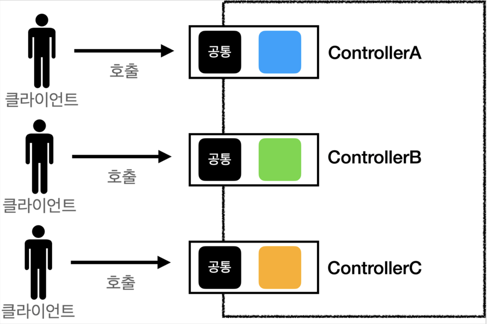
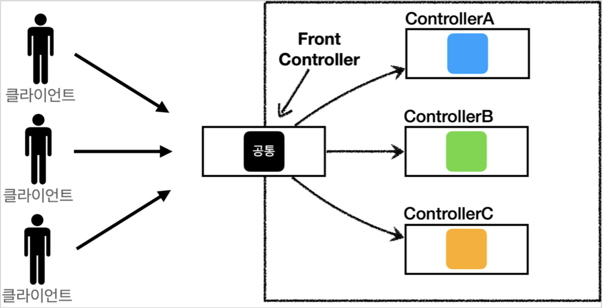
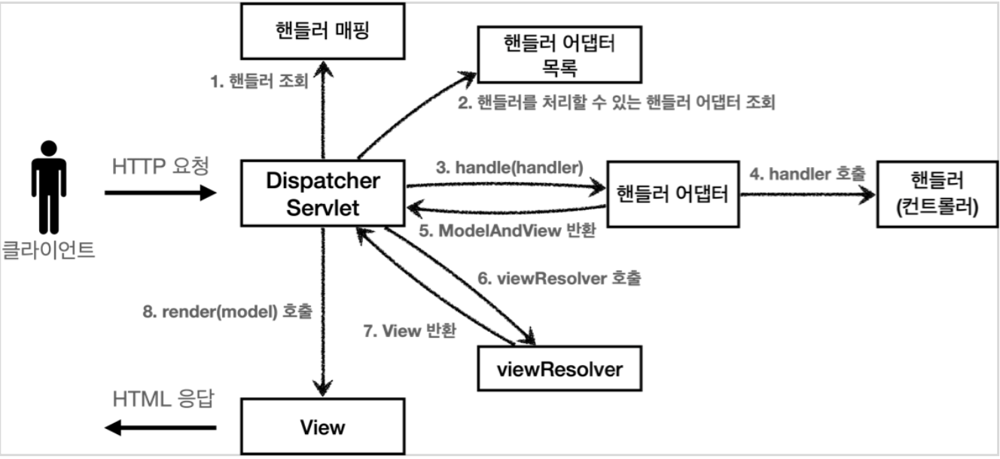
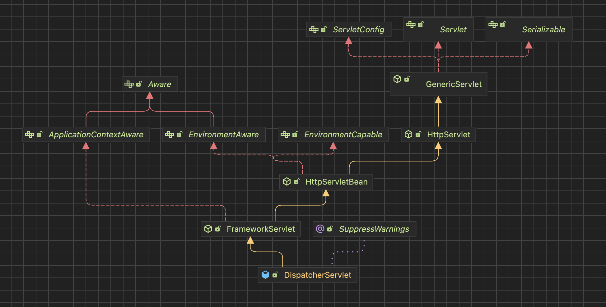
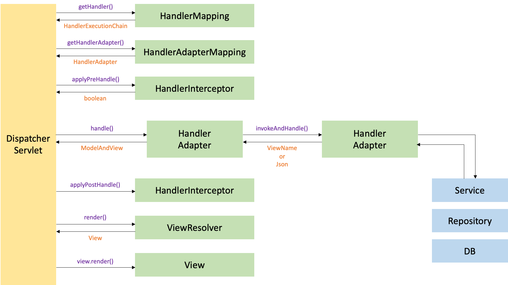

# 프론트 컨트롤러
- 도입 전


- 도입 후


## FrontController 패턴 특징
- FrontController 서블릿 하나로 클라이언트의 요청을 받음
- FrontController가 요청에 맞는 컨트롤러를 찾아서 호출
- 입구를 하나로
- 공통 처리 가능
- 프론트 컨트롤러를 제외한 나머지 컨트롤러는 서블릿을 사용하지 않아도 됨

## 스프링 웹 MVC와 프론트 컨트롤러
- 스프링 웹 MVC의 핵심도 바로 FrontController
- 스프링 웹 MVC의 DispatcherServlet이 FrontController 패턴으로 구현되어 있음



### DispatcherServlet 구조 살펴보기
스프링 MVC의 프론트 컨트롤러는 다음 패키지에 있는 DispatcherServlet이다.
`org.springframework.web.servlet.DispatcherServlet`

#### [DispatcherServlet 서블릿 등록]
- `DispatcherServlet`은 부모 클래스에서 `HttpServlet`을 상속받아서 사용하고, 서블릿으로 동작한다.
  - DispatcherServlet -> FrameworkServlet -> HttpServletBean -> HttpServlet
- 스프링 부트는 DispatcherServlet을 서블릿으로 자동으로 등록하면서 모든 경로(urlPatterns="/")에 대해서 매핑한다.
  - 더 자세한 경로가 우선순위가 높다. 그래서 기존에 등록한 서블릿도 함께 동작한다.

- 요청 흐름
  - 서블릿이 호출되면 HttpServlet이 제공하는 `service()`가 호출된다.
  - 스프링 MVC는 DispatcherServlet의 부모인 FrameworkServlet에서 `service()`를 override 해두었다.
  - `FrameworkServlet.service()`를 시작으로 여러 메서드가 호출되면서 `DispatcherServlet.doDispatch()`가 호출된다.

#### [`DispatcherServlet.doDispatch()` 분석]


`doService()`에서 attribute 설정 후 `doDispatch()`를 호출
**[`doService()`]**
```java
@Override
protected void doService(HttpServletRequest request, HttpServletResponse response) throws Exception {
    logRequest(request);

    // Keep a snapshot of the request attributes in case of an include,
    // to be able to restore the original attributes after the include.
    Map<String, Object> attributesSnapshot = null;
    if (WebUtils.isIncludeRequest(request)) {
        attributesSnapshot = new HashMap<>();
        Enumeration<?> attrNames = request.getAttributeNames();
        while (attrNames.hasMoreElements()) {
            String attrName = (String) attrNames.nextElement();
            if (this.cleanupAfterInclude || attrName.startsWith(DEFAULT_STRATEGIES_PREFIX)) {
                attributesSnapshot.put(attrName, request.getAttribute(attrName));
            }
        }
    }

    // Make framework objects available to handlers and view objects.
    request.setAttribute(WEB_APPLICATION_CONTEXT_ATTRIBUTE, getWebApplicationContext());
    request.setAttribute(LOCALE_RESOLVER_ATTRIBUTE, this.localeResolver);
    request.setAttribute(THEME_RESOLVER_ATTRIBUTE, this.themeResolver);
    request.setAttribute(THEME_SOURCE_ATTRIBUTE, getThemeSource());

    if (this.flashMapManager != null) {
        FlashMap inputFlashMap = this.flashMapManager.retrieveAndUpdate(request, response);
        if (inputFlashMap != null) {
            request.setAttribute(INPUT_FLASH_MAP_ATTRIBUTE, Collections.unmodifiableMap(inputFlashMap));
        }
        request.setAttribute(OUTPUT_FLASH_MAP_ATTRIBUTE, new FlashMap());
        request.setAttribute(FLASH_MAP_MANAGER_ATTRIBUTE, this.flashMapManager);
    }

    RequestPath previousRequestPath = null;
    if (this.parseRequestPath) {
        previousRequestPath = (RequestPath) request.getAttribute(ServletRequestPathUtils.PATH_ATTRIBUTE);
        ServletRequestPathUtils.parseAndCache(request);
    }

    try {
        doDispatch(request, response);
    }
    finally {
        if (!WebAsyncUtils.getAsyncManager(request).isConcurrentHandlingStarted()) {
            // Restore the original attribute snapshot, in case of an include.
            if (attributesSnapshot != null) {
                restoreAttributesAfterInclude(request, attributesSnapshot);
            }
        }
        if (this.parseRequestPath) {
            ServletRequestPathUtils.setParsedRequestPath(previousRequestPath, request);
        }
    }
}
```

`doDispatch()`에서 Adapter의 역할을 함
**[`doDispatch()`]**
```java
@SuppressWarnings("deprecation")
protected void doDispatch(HttpServletRequest request, HttpServletResponse response) throws Exception {
    HttpServletRequest processedRequest = request;
    HandlerExecutionChain mappedHandler = null;
    boolean multipartRequestParsed = false;

    WebAsyncManager asyncManager = WebAsyncUtils.getAsyncManager(request);

    try {
        ModelAndView mv = null;
        Exception dispatchException = null;

        try {
            processedRequest = checkMultipart(request);
            multipartRequestParsed = (processedRequest != request);

            // Determine handler for the current request.
            mappedHandler = getHandler(processedRequest);
            if (mappedHandler == null) {
                noHandlerFound(processedRequest, response);
                return;
            }

            // Determine handler adapter for the current request.
            HandlerAdapter ha = getHandlerAdapter(mappedHandler.getHandler());

            // Process last-modified header, if supported by the handler.
            String method = request.getMethod();
            boolean isGet = HttpMethod.GET.matches(method);
            if (isGet || HttpMethod.HEAD.matches(method)) {
                long lastModified = ha.getLastModified(request, mappedHandler.getHandler());
                if (new ServletWebRequest(request, response).checkNotModified(lastModified) && isGet) {
                    return;
                }
            }

            if (!mappedHandler.applyPreHandle(processedRequest, response)) {
                return;
            }

            // Actually invoke the handler.
            mv = ha.handle(processedRequest, response, mappedHandler.getHandler());

            if (asyncManager.isConcurrentHandlingStarted()) {
                return;
            }

            applyDefaultViewName(processedRequest, mv);
            mappedHandler.applyPostHandle(processedRequest, response, mv);
        }
        catch (Exception ex) {
            dispatchException = ex;
        }
        catch (Throwable err) {
            // As of 4.3, we're processing Errors thrown from handler methods as well,
            // making them available for @ExceptionHandler methods and other scenarios.
            dispatchException = new ServletException("Handler dispatch failed: " + err, err);
        }
        processDispatchResult(processedRequest, response, mappedHandler, mv, dispatchException);
    }
    catch (Exception ex) {
        triggerAfterCompletion(processedRequest, response, mappedHandler, ex);
    }
    catch (Throwable err) {
        triggerAfterCompletion(processedRequest, response, mappedHandler,
                new ServletException("Handler processing failed: " + err, err));
    }
    finally {
        if (asyncManager.isConcurrentHandlingStarted()) {
            // Instead of postHandle and afterCompletion
            if (mappedHandler != null) {
                mappedHandler.applyAfterConcurrentHandlingStarted(processedRequest, response);
            }
        }
        else {
            // Clean up any resources used by a multipart request.
            if (multipartRequestParsed) {
                cleanupMultipart(processedRequest);
            }
        }
    }
}
```

getHandler에서 handlerMapping에서 알맞은 HandlerExecutionChain을 가져옴
**[`getHandler()`]**
```java
@Nullable
protected HandlerExecutionChain getHandler(HttpServletRequest request) throws Exception {
    if (this.handlerMappings != null) {
        for (HandlerMapping mapping : this.handlerMappings) {
            HandlerExecutionChain handler = mapping.getHandler(request);
            if (handler != null) {
                return handler;
            }
        }
    }
    return null;
}
```

만약 handler를 찾지 못했다면 `noHandlerFount()`가 실행되어 NOT FOUND 전송
**[`noHandlerFound()`]**
```java
protected void noHandlerFound(HttpServletRequest request, HttpServletResponse response) throws Exception {
    if (pageNotFoundLogger.isWarnEnabled()) {
        pageNotFoundLogger.warn("No mapping for " + request.getMethod() + " " + getRequestUri(request));
    }
    if (this.throwExceptionIfNoHandlerFound) {
        throw new NoHandlerFoundException(request.getMethod(), getRequestUri(request),
                new ServletServerHttpRequest(request).getHeaders());
    }
    else {
        response.sendError(HttpServletResponse.SC_NOT_FOUND);
    }
}
```

HandlerExecutionChain의 `applyPreHandle()`에서 interceptor를 순서대로 접근하게 해준다.
**[`applyPreHandle()`]**
```java
boolean applyPreHandle(HttpServletRequest request, HttpServletResponse response) throws Exception {
    for (int i = 0; i < this.interceptorList.size(); i++) {
        HandlerInterceptor interceptor = this.interceptorList.get(i);
        if (!interceptor.preHandle(request, response, this.handler)) {
            triggerAfterCompletion(request, response, null);
            return false;
        }
        this.interceptorIndex = i;
    }
    return true;
}
```

그 다음 얻은 HandlerAdapter에서 `handle()`메서드를 호출하여 `handle()`메서드에서 HttpServletHandler의 `handleRequest()`를 수행한다.
```java
public class HttpRequestHandlerAdapter implements HandlerAdapter {

	@Override
	public boolean supports(Object handler) {
		return (handler instanceof HttpRequestHandler);
	}

	@Override
	@Nullable
	public ModelAndView handle(HttpServletRequest request, HttpServletResponse response, Object handler)
			throws Exception {

		((HttpRequestHandler) handler).handleRequest(request, response);
		return null;
	}

	@Override
	@SuppressWarnings("deprecation")
	public long getLastModified(HttpServletRequest request, Object handler) {
		if (handler instanceof LastModified lastModified) {
			return lastModified.getLastModified(request);
		}
		return -1L;
	}

}
```

`handleRequest()`는 HttpServletHandler에 선언되어 있으며 기본 구현체로 DefaultServletHttpRequestHandler가 있다.
**[`DefaultServletHttpRequestHandler`]**
```java
public class DefaultServletHttpRequestHandler implements HttpRequestHandler, ServletContextAware {

	/** Default Servlet name used by Tomcat, Jetty, JBoss, and GlassFish. */
	private static final String COMMON_DEFAULT_SERVLET_NAME = "default";

	/** Default Servlet name used by Google App Engine. */
	private static final String GAE_DEFAULT_SERVLET_NAME = "_ah_default";

	/** Default Servlet name used by Resin. */
	private static final String RESIN_DEFAULT_SERVLET_NAME = "resin-file";

	/** Default Servlet name used by WebLogic. */
	private static final String WEBLOGIC_DEFAULT_SERVLET_NAME = "FileServlet";

	/** Default Servlet name used by WebSphere. */
	private static final String WEBSPHERE_DEFAULT_SERVLET_NAME = "SimpleFileServlet";


	@Nullable
	private String defaultServletName;

	@Nullable
	private ServletContext servletContext;


	/**
	 * Set the name of the default Servlet to be forwarded to for static resource requests.
	 */
	public void setDefaultServletName(String defaultServletName) {
		this.defaultServletName = defaultServletName;
	}

	/**
	 * If the {@code defaultServletName} property has not been explicitly set,
	 * attempts to locate the default Servlet using the known common
	 * container-specific names.
	 */
	@Override
	public void setServletContext(ServletContext servletContext) {
		this.servletContext = servletContext;
		if (!StringUtils.hasText(this.defaultServletName)) {
			if (this.servletContext.getNamedDispatcher(COMMON_DEFAULT_SERVLET_NAME) != null) {
				this.defaultServletName = COMMON_DEFAULT_SERVLET_NAME;
			}
			else if (this.servletContext.getNamedDispatcher(GAE_DEFAULT_SERVLET_NAME) != null) {
				this.defaultServletName = GAE_DEFAULT_SERVLET_NAME;
			}
			else if (this.servletContext.getNamedDispatcher(RESIN_DEFAULT_SERVLET_NAME) != null) {
				this.defaultServletName = RESIN_DEFAULT_SERVLET_NAME;
			}
			else if (this.servletContext.getNamedDispatcher(WEBLOGIC_DEFAULT_SERVLET_NAME) != null) {
				this.defaultServletName = WEBLOGIC_DEFAULT_SERVLET_NAME;
			}
			else if (this.servletContext.getNamedDispatcher(WEBSPHERE_DEFAULT_SERVLET_NAME) != null) {
				this.defaultServletName = WEBSPHERE_DEFAULT_SERVLET_NAME;
			}
			else {
				throw new IllegalStateException("Unable to locate the default servlet for serving static content. " +
						"Please set the 'defaultServletName' property explicitly.");
			}
		}
	}


	@Override
	public void handleRequest(HttpServletRequest request, HttpServletResponse response)
			throws ServletException, IOException {

		Assert.state(this.servletContext != null, "No ServletContext set");
		RequestDispatcher rd = this.servletContext.getNamedDispatcher(this.defaultServletName);
		if (rd == null) {
			throw new IllegalStateException("A RequestDispatcher could not be located for the default servlet '" +
					this.defaultServletName + "'");
		}
		rd.forward(request, response);
	}
}
```

이후 `applyDefaultViewName(processedRequest, mv);`를 통해 ViewName을 ModelAndView에 등록하고 `processDispatchResult`을 통해 최종적으로 요청을 처리하여 뷰를 랜더링한다.

**[`applyDefaultViewName()`]**
```java
private void applyDefaultViewName(HttpServletRequest request, @Nullable ModelAndView mv) throws Exception {
    if (mv != null && !mv.hasView()) {
        String defaultViewName = getDefaultViewName(request);
        if (defaultViewName != null) {
            mv.setViewName(defaultViewName);
        }
    }
}
```

**[`processDispatchResult()`]**
```java
private void processDispatchResult(HttpServletRequest request, HttpServletResponse response,
			@Nullable HandlerExecutionChain mappedHandler, @Nullable ModelAndView mv,
			@Nullable Exception exception) throws Exception {

    boolean errorView = false;

    if (exception != null) {
        if (exception instanceof ModelAndViewDefiningException mavDefiningException) {
            logger.debug("ModelAndViewDefiningException encountered", exception);
            mv = mavDefiningException.getModelAndView();
        }
        else {
            Object handler = (mappedHandler != null ? mappedHandler.getHandler() : null);
            mv = processHandlerException(request, response, handler, exception);
            errorView = (mv != null);
        }
    }

    // Did the handler return a view to render?
    if (mv != null && !mv.wasCleared()) {
        render(mv, request, response);
        if (errorView) {
            WebUtils.clearErrorRequestAttributes(request);
        }
    }
    else {
        if (logger.isTraceEnabled()) {
            logger.trace("No view rendering, null ModelAndView returned.");
        }
    }

    if (WebAsyncUtils.getAsyncManager(request).isConcurrentHandlingStarted()) {
        // Concurrent handling started during a forward
        return;
    }

    if (mappedHandler != null) {
        // Exception (if any) is already handled..
        mappedHandler.triggerAfterCompletion(request, response, null);
    }
}
```

