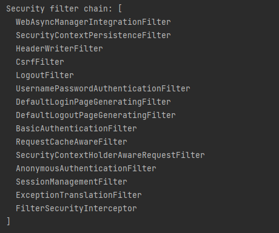

# Filter

## Servlet Container Filter

- 서블릿 컨테이너의 Fitler는 Dispatch Servlet으로 가기 전에 먼저 적용된다.
- Filter들은 여러 개가 연결되어 있어 Filter Chain이라고도 불린다.
- 모든 Request 들은 Filter Chain을 거쳐야지 Servlet에 도착하게 된다.

## Spring Security Filter

- Spring Security는 DelegatingFilterProxy라는 필터를 만들어 메인 Filter Chain에 끼워넣고, 그 아래 다시 SecurityFilterChain 그룹을 등록한다.
- 그렇게 하며 URL에 따라 적용되는 Filter Chain을 다르게 하는 방법을 사용한다.
- 어떠한 경우에는 해당 Filter를 무시하고 통과하게 할 수 있다.
- ~~`WebSecurityConfigurerAdapter`는 Filter Chain을 구성하는 Configuration 클래스로 해당 클래스의 상속을 통해 Filter Chain을 구성할 수 있다.~~
- ~~`configure(HttpSecurity http)`를 Override하며 filter들을 세팅한다.~~
- Spring Security 5.7.0-M2 부터는 사용자가 컴포넌트 기반의 configuration을 구성하도록 권장하기 때문에 `WebSecurityConfigurerAdapter`를 상속하는 방식은 삭제되고 SecurityFilterChain 빈을 등록하는 방식으로 구성하도록 한다.

### Spring Security Filter Chain

EnableWebSecurity에 debug=true 값을 주면 다음과 같이 filter chain을 확인할 수 있다.

그럼 각각의 필터가 무슨 역할을 하는지 살펴보자

### Security Filters

- HeaderWriterFilter: Request의 HTTP 헤더를 검사하여 헤더를 추가하거나 빼주는 역할을 한다.
- CorsFilter: 허가된 사이트나 클라이언트의 요청인지 검사하는 역할을 한다.
- CsrfFilter: Post나 Put과 같이 리소스를 변경하는 요청의 경우 내가 내보냈던 리소스에서 올라온 요청인지 확인한다.
- LogoutFilter: Request가 로그아웃하겠다고 하는 것인지 체크한다.
- UsernamePasswordAuthenticationFilter: username / password로 로그인을 하려고하는지 체크하여 승인이 되면 Authentication을 부여하고 이동할 페이지로 이동한다.
- ConcurrentSessionFilter: 동시 접속을 허용할지 체크한다.
- BearerTokenAuthenticationFilter: Authorization 헤더에 Bearer 토큰을 인증해주는 역할을 한다.
- BasicAuthenticationFilter: Authorization 헤더에 Basic 토큰을 인증해주는 역할을 한다.
- RequestCacheAwareFilter: Request한 내용을 Cache에 담아주는 역할을 한다. 다음 Request가 오면 이전의 Cache 값을 줄 수 있다.
- SecurityContextHolderAwareRequestFilter: 보안 관련 Servlet3 스펙을 지원하기 위한 필터이다.
- RememberMeAuthenticationFilter: 아직 Authentication 인증이 안된 경우라면 RememberMe 쿠키를 검사해서 인증 처리해준다.
- AnonymousAuthenticationFilter: 앞선 필터를 통해 인증이 안되었다면 해당 유저는 익명 사용자라고 Authentication을 정해주는 역할을 한다. -> Authentication이 null인 것을 방지한다.
- SessionManagementFilter: 서버에서 지정한 세션 정책에 맞게 사용자가 사용하고 있는지 검사하는 역할을 한다.
- ExceptionTranslationFilter: 이 필터 이후에 인증이나 권한 예외가 발생하면 이 필터가 처리를 해준다.
- FilterSecurityInterceptor: 사용자가 요청한 Request에 들어가고 결과를 return 해도 되는 권한(Authorization)이 있는지를 체크한다. 해당 필터에서 권한이 없다는 결과가 나온다면 위의 ExceptionTranslationFilter에서 Exception을 처리해준다.
