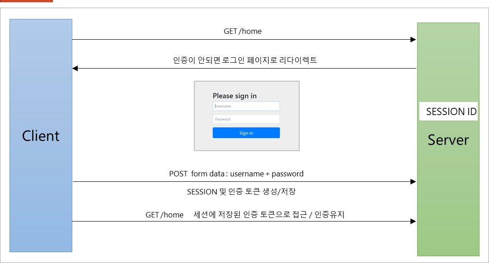

# Form

## Form 인증

Security에서는 로그인할 수 있는 Form을 제공해준다.

### 과정



### 설정

```java
@Configuration
@EnableWebSecurity
public class SecurityConfig {

    @Bean
    public SecurityFilterChain filterChain(HttpSecurity http) throws Exception {
        http.formLogin()
                .loginPage("/login.html") // 사용자 정의 로그인 페이지
                .defaultSuccessUrl("/home") // 로그인 성공 후 이동 페이지
                .failureUrl("/login.html?error=true") // 로그인 실패 후 이동 페이지
                .usernameParameter("username") // 아이디 파라미터명
                .passwordParameter("password") // 패스워드 파라미터명
                .loginProcessingUrl("/login") // 로그인 Form Action URI
                .successHandler(loginSuccessHandler()) // 성공 시 handler
                .failureHandler(loginFailureHandler()); // 실패 시 handler

        return http.build();
    }
}
```
