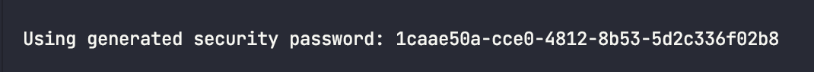

# Spring Security Settings

## Dependency

### XML

```xml
<dependency>
    <groupId>org.springframework.boot</groupId>
    <artifactId>spring-boot-starter-security</artifactId>
</dependency>
```

### Gradle

```groovy
implementation 'org.springframework.boot:spring-boot-starter-security'
```

## 의존성 추가 시 일어나는 일

- 서버가 기동되면 spring security의 초기화 작업 및 보안 설정이 이루어진다
- 별도의 설정이나 구현을 하지 않아도 기본적인 웹 보안 기능이 현재 시스템에 연동되어 작동한다
  1. 모든 요청은 인증되어야 자원에 접근 가능
  2. 인증 방식은 form 로그인 방식과 httpBasic 로그인 방식을 제공
  3. 기본 로그인 페이지를 제공
  4. 기본 계정 한 개 제공 (username: user, password: random string)

의존성을 추가한 상태에서 실행을 시켜보면

이렇게 랜덤으로 비밀번호가 생성된다. 형태를 보아하니 UUID로 생성해주는 듯 하다

만약 패스워드를 직접 지정해주고 싶다면 application.properties 또는 .yml에서 지정해줄 수 있다.

```properties
spring.security.user.name=user
spring.security.user.password=1234
```

이 기본 설정을 Config 클래스를 생성하여 변경해주도록 하자.

이전까지는 `WebSecurityConfigurerAdapter`를 상속하여 사용했지만 지금은 deprecated 됐으니 사용하지 말자.
게다가 spring boot 3.0 이상에서는 삭제되어 사용하지 못한다.

먼저 다음과 같이 클래스를 생성하자

```java
@Configuration
@EnableWebSecurity
public class SecurityConfig {

}
```

여기서 `@EnableWebSecurity`는 다음과 같이 Security를 설정하는 클래스들을 Import 하는 어노테이션이다.

```java
@Retention(RetentionPolicy.RUNTIME)
@Target(ElementType.TYPE)
@Documented
@Import({ WebSecurityConfiguration.class, SpringWebMvcImportSelector.class, OAuth2ImportSelector.class,
		HttpSecurityConfiguration.class })
@EnableGlobalAuthentication
public @interface EnableWebSecurity {

	/**
	 * Controls debugging support for Spring Security. Default is false.
	 * @return if true, enables debug support with Spring Security
	 */
	boolean debug() default false;

}
```

그 다음 `SecurityConfig`안에 `SecurityFilterChain`을 Bean으로 등록하기 위한 메서드를 작성하자

```java
@Configuration
@EnableWebSecurity
public class SecurityConfig {

    @Bean
    public SecurityFilterChain filterChain(HttpSecurity http) throws Exception {
        // 인가
        http
                .authorizeHttpRequests(
                        request -> request.anyRequest().authenticated()
                );

        // 다음과 같이 쓸 수도 있다.
//        http
//                .authorizeHttpRequests()
//                .anyRequest().authenticated();


        // 인증
        http
                .formLogin();

        return http.build();
    }
}
```

이렇게 인증/인가 관련 설정을 지정할 수 있다. 만약 WebSecurityConfigurerAdapter를 사용하고 있다면, 다음과 같은 형태를 위와 같이 쓴다고 생각하면 된다.

```java
@Configuration
@EnableWebSecurity
public class SecurityConfiguration extends WebSecurityConfigurerAdapter {

    @Override
    protected void configure(HttpSecurity http) throws Exception {
        http
            .authorizeHttpRequests(requests -> requests
                .anyRequest().authenticated()
            );

        http
                .formLogin();
    }
}
```
